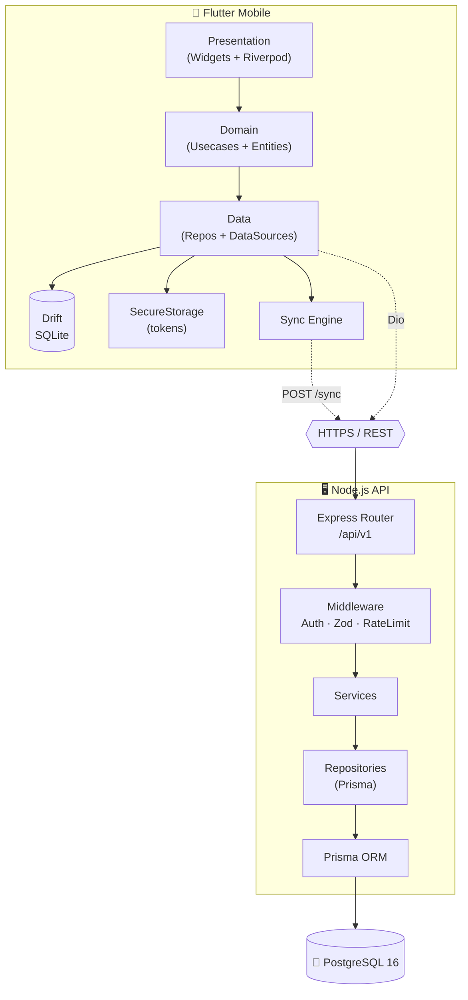
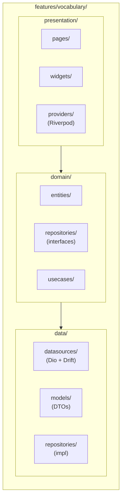
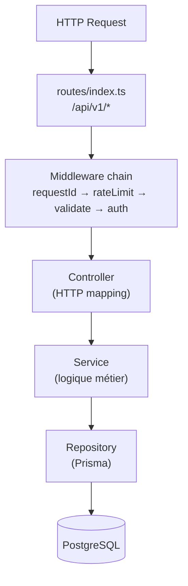
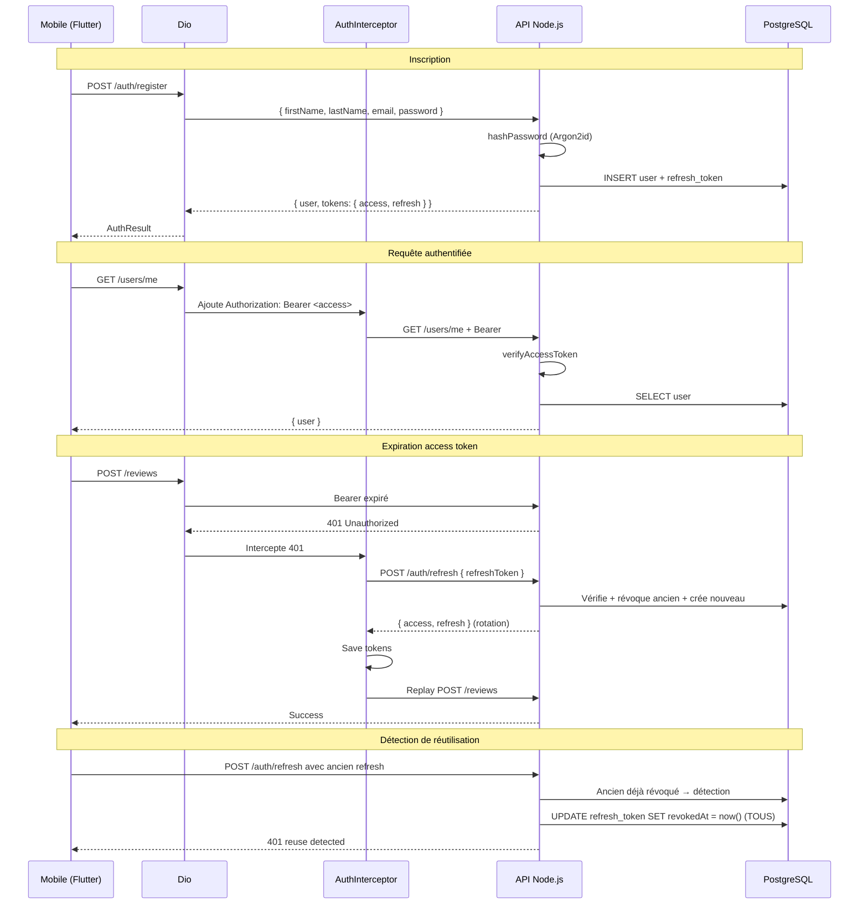
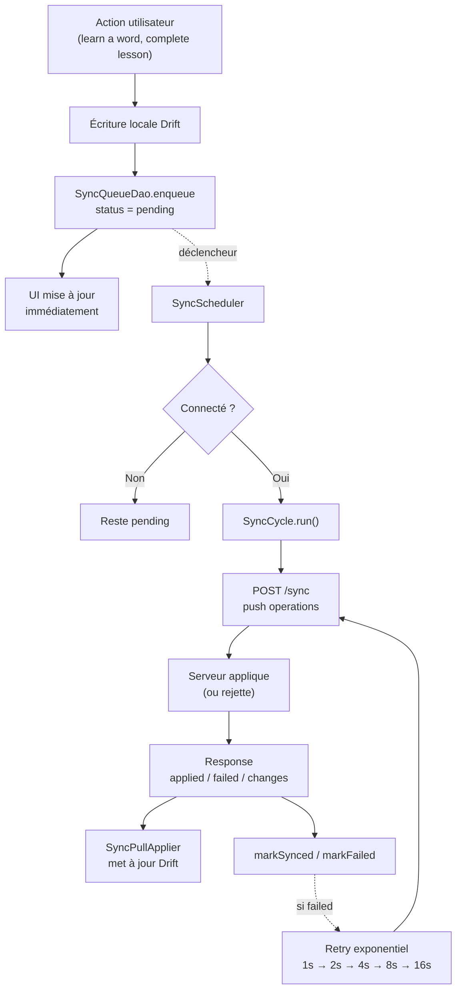
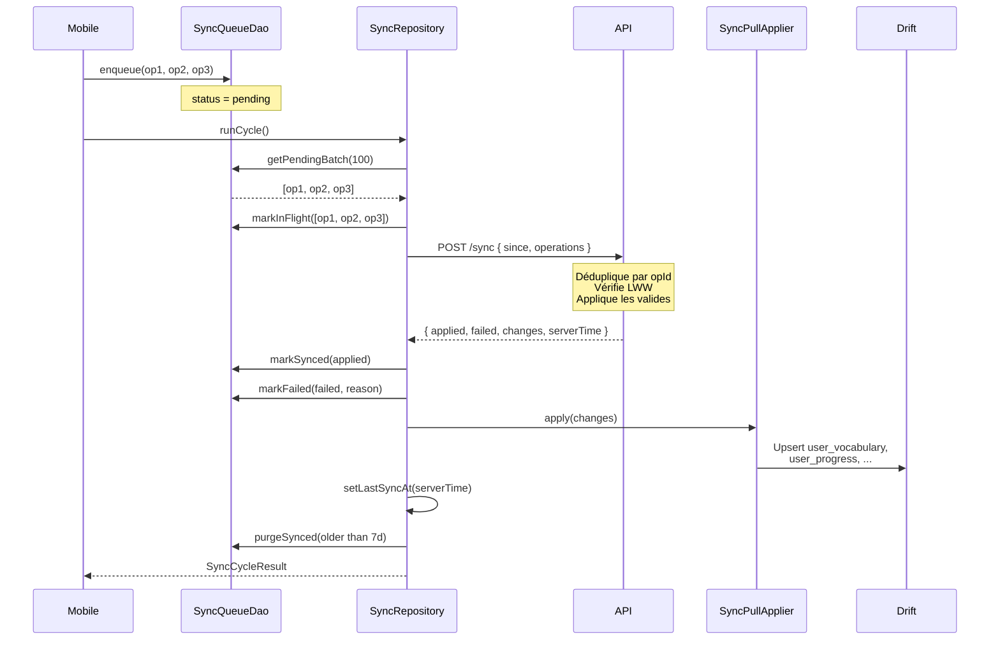

# 🏛️ Architecture — LangApp

> Vue d'ensemble de l'architecture logicielle, des choix techniques et des flux de données.

---

## 📑 Table des matières

- [Vue d'ensemble](#-vue-densemble)
- [Diagramme global](#-diagramme-global)
- [Architecture Flutter](#-architecture-flutter)
- [Architecture backend](#-architecture-backend)
- [Flux d'authentification](#-flux-dauthentification)
- [Flux offline-first](#-flux-offline-first)
- [Flux de synchronisation](#-flux-de-synchronisation)
- [Décisions techniques](#-décisions-techniques)
- [Contraintes & compromis](#-contraintes--compromis)

---

## 🎯 Vue d'ensemble

LangApp est composé de **trois couches** principales :

1. **Mobile (Flutter)** — Application cross-platform, offline-first, basée sur Clean Architecture + feature-first.
2. **Backend (Node.js + Express)** — API REST modulaire, authentifiée, scalable horizontalement.
3. **Base de données (PostgreSQL)** — 25 tables normalisées, UUID, soft delete, index ciblés.

Le tout est **conteneurisé** (Docker), **testé** (Jest + Flutter Test), et **déployé** via GitHub Actions + Caddy.

---

## 🌐 Diagramme global



---

## 🧩 Architecture Flutter

### Clean Architecture + feature-first

Chaque **feature** est autonome et suit le triplet `data / domain / presentation` :



**Règles de dépendance** :
- ✅ `presentation` → `domain` → `data`
- ❌ Jamais l'inverse
- ❌ `domain` ne connaît ni Dio, ni Drift, ni Riverpod
- ✅ `data` implémente les interfaces `domain`

### Gestion d'état (Riverpod)

| Type de provider | Usage |
|---|---|
| `Provider` | DI (repos, datasources, services) |
| `FutureProvider` | Lecture async one-shot (catalogue, stats) |
| `StreamProvider` | Flux continus (connectivité, sync count) |
| `NotifierProvider` | État mutable complexe (auth, session, sync) |
| `FutureProvider.family` | Paramétrés (détail par id, query) |

### Arborescence type

```
lib/
├── core/                          # Infrastructure transversale
│   ├── config/app_env.dart        # dev/staging/prod
│   ├── constants/
│   ├── errors/app_failure.dart    # sealed class
│   ├── network/
│   │   ├── dio_client.dart
│   │   ├── auth_interceptor.dart  # JWT + refresh auto
│   │   ├── error_interceptor.dart
│   │   └── network_info.dart
│   ├── router/
│   ├── storage/
│   │   ├── secure_storage.dart
│   │   ├── preferences.dart
│   │   └── drift/                 # 20 tables
│   ├── sync/sync_scheduler.dart
│   ├── theme/                     # Material 3
│   └── utils/
│       ├── result.dart            # Either<Failure, T>
│       ├── sm2.dart               # Miroir SRS
│       └── validators.dart
│
├── features/
│   ├── auth/                      # Login, Register, ...
│   ├── onboarding/                # 7 étapes
│   ├── home/                      # Dashboard
│   ├── languages/
│   ├── courses/
│   ├── lessons/
│   ├── vocabulary/
│   ├── flashcards/
│   ├── exercises/                 # 7 types
│   ├── review/                    # SRS enrichi
│   ├── goals/
│   ├── streak/
│   ├── statistics/
│   ├── profile/
│   └── sync/
│
└── main.dart
```

---

## 🖥️ Architecture backend

### Modulaire + layered



**Règle d'or** :
- **Controller** : uniquement HTTP (req → params, res → json). Aucune logique.
- **Service** : toute la logique métier, aucune dépendance HTTP.
- **Repository** : accès Prisma, aucune logique métier.
- **Transaction** : orchestrée par le service.

### Modules

| Module | Responsabilité | Endpoints principaux |
|---|---|---|
| `auth` | Register, login, refresh, reset | `/auth/*` |
| `users` | Profil courant | `/users/me` |
| `languages` | Catalogue langues | `/languages` |
| `courses` | Cours + modules | `/courses` |
| `lessons` | Leçons + complétion | `/lessons` |
| `vocabulary` | Mots + traductions + user_vocabulary | `/vocabulary` |
| `exercises` | Correction + scoring | `/exercises` |
| `reviews` | SRS SM-2 + sessions | `/reviews` |
| `progress` | Progression leçons | `/progress` |
| `streaks` | Séries + calendrier | `/streak` |
| `goals` | Objectifs quotidiens | `/goals` |
| `statistics` | Agrégats | `/statistics` |
| `synchronization` | Push/pull offline | `/sync` |

### Middlewares transverses

```mermaid
flowchart LR
    IN["Request"] --> RID["requestId"]
    RID --> LOG["pinoHttp"]
    LOG --> SEC["helmet"]
    SEC --> CORS["cors"]
    CORS --> BODY["json body 1mb"]
    BODY --> LIM["rateLimit global"]
    LIM --> VAL["validate Zod"]
    VAL --> AUTH["authenticate JWT"]
    AUTH --> RBAC["authorize RBAC"]
    RBAC --> CTRL["Controller"]
    CTRL --> OUT["Response"]
    CTRL -.->|err| ERR["errorHandler"]
    ERR --> OUT
```



---

## 🔐 Flux d'authentification



**Sécurité** :
- **Access token** : JWT HS256, 15 min, contient `sub`, `email`, `role`, `emailVerified`.
- **Refresh token** : opaque (32 octets base64url), hashé SHA-256 en DB, rotation à chaque usage.
- **Détection de réutilisation** : si un refresh révoqué est présenté → toutes les sessions de l'utilisateur sont révoquées.

---

## 📴 Flux offline-first



**Déclencheurs** :
1. Démarrage de l'app (après auth)
2. Retour de connectivité
3. Timer périodique (5 min)
4. Retour foreground (`WidgetsBindingObserver`)
5. Action utilisateur (bouton manuel)

---

## 🔄 Flux de synchronisation



**Idempotence** : chaque opération a un UUID client. Si déjà traité, le serveur retourne sans erreur (ni `applied` ni `failed`).

**Résolution de conflits** : last-write-wins basé sur `updatedAt` (comparé au `clientTimestamp`). Exception : `user_progress.COMPLETED` côté client gagne toujours.

**Soft delete** : propagé via `deletedAt`. Résurrection possible par UPSERT si `clientTimestamp > updatedAt`.

---

## 🎯 Décisions techniques

### Pourquoi Riverpod (vs Bloc, Provider, GetX) ?

| Critère | Riverpod | Bloc | Provider |
|---|---|---|---|
| Compile-safe | ✅ | ✅ | ❌ |
| Testable sans BuildContext | ✅ | ✅ | ❌ |
| Pas de `ProviderNotFoundException` | ✅ | ✅ | ❌ |
| Boilerplate | Moyen | Élevé | Faible |
| Offline-friendly (family, autoDispose) | ✅ | ⚠️ | ❌ |

### Pourquoi Drift (vs Hive, sqflite, Isar) ?

| Critère | Drift | Hive | sqflite | Isar |
|---|---|---|---|---|
| Typé | ✅ | ⚠️ | ❌ | ✅ |
| SQL relationnel | ✅ | ❌ | ✅ | ❌ |
| Migrations | ✅ | ❌ | Manuel | ⚠️ |
| Codegen | ✅ | ❌ | ❌ | ✅ |
| Miroir backend | ✅ | ❌ | ✅ | ❌ |

Drift permet de **refléter exactement** le schéma PostgreSQL, ce qui simplifie la sync (mêmes colonnes, mêmes types).

### Pourquoi Prisma (vs TypeORM, Sequelize, Knex) ?

- Migrations versionnées et rejouables
- Client TypeScript **fully typed** généré
- Requêtes paramétrées (protection SQL injection native)
- Studio pour l'inspection visuelle
- Seed natif

### Pourquoi SM-2 (vs FSRS, Leitner) ?

- Standard éprouvé (SuperMemo, Anki)
- Simple à implémenter et à tester
- Extensible vers FSRS sans migration de schéma
- Miroir client/serveur trivial

### Pourquoi Caddy (vs Nginx, Traefik) ?

- HTTPS **automatique** (Let's Encrypt)
- Config Caddyfile **5x plus courte** que Nginx
- Health check upstream natif
- Logs JSON rotatifs natifs

---

## ⚖️ Contraintes & compromis

| Contrainte | Compromis retenu |
|---|---|
| Offline complet impossible | Soft deletes propagés, résurrection par UPSERT |
| Conflits multi-device | LWW sur `updatedAt` (99 % des cas OK) |
| Taille de l'APK | Split ABI + R8 (proguard) |
| Cold start | Splash + init DB en parallèle, `< 2s` |
| Coût serveur | 1 VPS 2 vCPU/2GB suffit pour 10k users |
| Sécurité | Rate limit global, JWT courts, rotation, Helmet |
| Contenu | Seed minimal + admin via API (P22+) |

---

## 📚 Voir aussi

- [API Reference](./api.md)
- [Database Schema](./database.md)
- [Offline Sync](./offline-sync.md)
- [Deployment Guide](../deploy/README.md)
