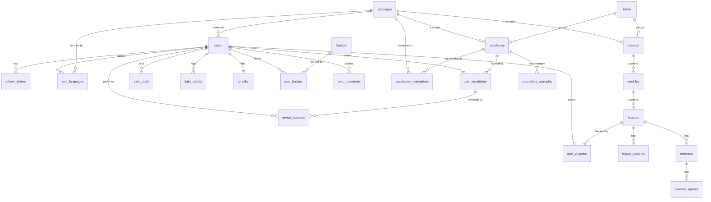

# 🐘 Database Schema — LangApp

> Modèle de données PostgreSQL 16 (Prisma ORM). 25 tables, UUID, soft delete, index ciblés.

---

## 📑 Table des matières

- [Vue d'ensemble](#-vue-densemble)
- [Diagramme entité-relation](#-diagramme-entité-relation)
- [Tables par domaine](#-tables-par-domaine)
- [Conventions](#-conventions)
- [Index & performances](#-index--performances)
- [Migrations](#-migrations)
- [Bonnes pratiques](#-bonnes-pratiques)

---

## 🎯 Vue d'ensemble

**5 domaines fonctionnels** :

```
┌──────────────────────────────────────────────────────────┐
│  IDENTITÉ                                                │
│  users · refresh_tokens                                  │
├──────────────────────────────────────────────────────────┤
│  CONTENU PÉDAGOGIQUE                                     │
│  languages · levels · courses · modules · lessons        │
│  lesson_contents · vocabulary · vocabulary_translations  │
│  vocabulary_examples · exercises · exercise_options      │
├──────────────────────────────────────────────────────────┤
│  APPRENTISSAGE UTILISATEUR                               │
│  user_languages · user_progress · user_vocabulary        │
│  review_sessions                                         │
├──────────────────────────────────────────────────────────┤
│  ENGAGEMENT & GAMIFICATION                               │
│  daily_goals · daily_activity · streaks · badges         │
│  user_badges                                             │
├──────────────────────────────────────────────────────────┤
│  SYNCHRONISATION                                         │
│  sync_operations                                         │
└──────────────────────────────────────────────────────────┘
```

---

## 🔗 Diagramme entité-relation



---

## 📋 Tables par domaine

### 🔐 IDENTITÉ

#### `users`

Utilisateurs de l'application.

| Colonne | Type | Contraintes |
|---|---|---|
| `id` | `uuid` | PK |
| `email` | `text` | UNIQUE, NOT NULL |
| `password_hash` | `text` | NOT NULL (Argon2id) |
| `first_name` | `text` | NOT NULL |
| `last_name` | `text` | NOT NULL |
| `role` | `Role` | DEFAULT `USER` |
| `email_verified` | `boolean` | DEFAULT `false` |
| `email_verification_token` | `text` | NULLABLE |
| `password_reset_token` | `text` | NULLABLE |
| `password_reset_expires` | `timestamp` | NULLABLE |
| `native_language_id` | `uuid` | FK → `languages.id`, NULLABLE |
| `xp` | `integer` | DEFAULT `0` |
| `user_level` | `integer` | DEFAULT `1` |
| `last_login_at` | `timestamp` | NULLABLE |
| `created_at` | `timestamp` | DEFAULT `now()` |
| `updated_at` | `timestamp` | `@updatedAt` |
| `deleted_at` | `timestamp` | NULLABLE (soft delete) |

**Enums** : `Role` = `USER` | `ADMIN` | `CONTENT_MANAGER`

**Index** : `email`, `deleted_at`

---

#### `refresh_tokens`

Refresh tokens opaques (hashés SHA-256).

| Colonne | Type | Contraintes |
|---|---|---|
| `id` | `uuid` | PK |
| `user_id` | `uuid` | FK → `users.id` CASCADE |
| `token_hash` | `text` | UNIQUE, NOT NULL |
| `user_agent` | `text` | NULLABLE |
| `ip_address` | `text` | NULLABLE |
| `expires_at` | `timestamp` | NOT NULL |
| `revoked_at` | `timestamp` | NULLABLE |
| `created_at` | `timestamp` | DEFAULT `now()` |

**Index** : `user_id`, `token_hash`

---

### 📚 CONTENU

#### `languages`

| Colonne | Type | Contraintes |
|---|---|---|
| `id` | `uuid` | PK |
| `code` | `text` | UNIQUE (ex : `fr`, `en`) |
| `name` | `text` | NOT NULL |
| `native_name` | `text` | NOT NULL |
| `flag_emoji` | `text` | NULLABLE |
| `is_active` | `boolean` | DEFAULT `true` |
| `created_at` / `updated_at` / `deleted_at` | `timestamp` | |

**Index** : `code`

---

#### `levels`

Niveaux CECRL (A1 → C2).

| Colonne | Type | Contraintes |
|---|---|---|
| `id` | `uuid` | PK |
| `code` | `CefrLevel` | UNIQUE (`A1` ... `C2`) |
| `name` | `text` | NOT NULL |
| `description` | `text` | NULLABLE |
| `order` | `integer` | NOT NULL |
| `created_at` / `updated_at` | `timestamp` | |

---

#### `courses`

| Colonne | Type | Contraintes |
|---|---|---|
| `id` | `uuid` | PK |
| `language_id` | `uuid` | FK → `languages.id` |
| `level_id` | `uuid` | FK → `levels.id` |
| `title` | `text` | NOT NULL |
| `description` | `text` | NULLABLE |
| `order` | `integer` | DEFAULT `0` |
| `is_published` | `boolean` | DEFAULT `false` |
| `created_at` / `updated_at` / `deleted_at` | `timestamp` | |

**Index** : `(language_id, level_id)`, `is_published`

---

#### `modules`

| Colonne | Type | Contraintes |
|---|---|---|
| `id` | `uuid` | PK |
| `course_id` | `uuid` | FK → `courses.id` CASCADE |
| `title` | `text` | NOT NULL |
| `description` | `text` | NULLABLE |
| `order` | `integer` | DEFAULT `0` |
| `created_at` / `updated_at` / `deleted_at` | `timestamp` | |

**Index** : `course_id`

---

#### `lessons`

| Colonne | Type | Contraintes |
|---|---|---|
| `id` | `uuid` | PK |
| `module_id` | `uuid` | FK → `modules.id` CASCADE |
| `title` | `text` | NOT NULL |
| `description` | `text` | NULLABLE |
| `order` | `integer` | DEFAULT `0` |
| `estimated_duration` | `integer` | DEFAULT `5` (minutes) |
| `is_published` | `boolean` | DEFAULT `false` |
| `created_at` / `updated_at` / `deleted_at` | `timestamp` | |

**Index** : `module_id`

---

#### `lesson_contents`

| Colonne | Type | Contraintes |
|---|---|---|
| `id` | `uuid` | PK |
| `lesson_id` | `uuid` | FK → `lessons.id` CASCADE |
| `type` | `LessonContentType` | `TEXT` \| `IMAGE` \| `AUDIO` \| `VIDEO` \| `MARKDOWN` |
| `content` | `text` | Contenu ou URL |
| `order` | `integer` | DEFAULT `0` |
| `created_at` / `updated_at` | `timestamp` | |

**Index** : `lesson_id`

---

#### `vocabulary`

| Colonne | Type | Contraintes |
|---|---|---|
| `id` | `uuid` | PK |
| `language_id` | `uuid` | FK → `languages.id` |
| `level_id` | `uuid` | FK → `levels.id` |
| `word` | `text` | NOT NULL |
| `phonetic` | `text` | NULLABLE (`/ˈæpəl/`) |
| `audio_url` | `text` | NULLABLE |
| `image_url` | `text` | NULLABLE |
| `category` | `text` | NULLABLE |
| `part_of_speech` | `text` | NULLABLE (`noun`, `verb`...) |
| `created_at` / `updated_at` / `deleted_at` | `timestamp` | |

**Index** : `language_id`, `level_id`, `word`

---

#### `vocabulary_translations`

| Colonne | Type | Contraintes |
|---|---|---|
| `id` | `uuid` | PK |
| `vocabulary_id` | `uuid` | FK → `vocabulary.id` CASCADE |
| `language_id` | `uuid` | FK → `languages.id` |
| `translation` | `text` | NOT NULL |
| `created_at` / `updated_at` | `timestamp` | |

**Contraintes** : `UNIQUE (vocabulary_id, language_id)`
**Index** : `vocabulary_id`

---

#### `vocabulary_examples`

| Colonne | Type | Contraintes |
|---|---|---|
| `id` | `uuid` | PK |
| `vocabulary_id` | `uuid` | FK → `vocabulary.id` CASCADE |
| `sentence` | `text` | NOT NULL |
| `translation` | `text` | NULLABLE |
| `audio_url` | `text` | NULLABLE |
| `order` | `integer` | DEFAULT `0` |
| `created_at` / `updated_at` | `timestamp` | |

**Index** : `vocabulary_id`

---

#### `exercises`

| Colonne | Type | Contraintes |
|---|---|---|
| `id` | `uuid` | PK |
| `lesson_id` | `uuid` | FK → `lessons.id` CASCADE |
| `type` | `ExerciseType` | (voir enum ci-dessous) |
| `question` | `text` | NOT NULL |
| `correct_answer` | `text` | NULLABLE |
| `explanation` | `text` | NULLABLE |
| `data` | `jsonb` | NULLABLE (payload spécifique) |
| `order` | `integer` | DEFAULT `0` |
| `created_at` / `updated_at` | `timestamp` | |

**Enums** : `ExerciseType` = `MULTIPLE_CHOICE` | `TRANSLATION` | `FILL_IN_THE_BLANK` | `MATCHING` | `WORD_ORDER` | `LISTENING` | `PRONUNCIATION`

**Index** : `lesson_id`

**Exemple `data` (jsonb)** :
```json
{ "pairs": [{ "left": "Apple", "right": "Pomme" }] }
{ "words": ["I", "am", "a", "student"] }
{ "audioUrl": "https://cdn.example.com/hello.mp3" }
```

---

#### `exercise_options`

| Colonne | Type | Contraintes |
|---|---|---|
| `id` | `uuid` | PK |
| `exercise_id` | `uuid` | FK → `exercises.id` CASCADE |
| `label` | `text` | NOT NULL |
| `is_correct` | `boolean` | DEFAULT `false` |
| `order` | `integer` | DEFAULT `0` |
| `created_at` / `updated_at` | `timestamp` | |

**Index** : `exercise_id`

> ⚠️ `is_correct` n'est **jamais** exposé côté client avant soumission.

---

### 🎓 APPRENTISSAGE

#### `user_languages`

| Colonne | Type | Contraintes |
|---|---|---|
| `id` | `uuid` | PK |
| `user_id` | `uuid` | FK → `users.id` CASCADE |
| `language_id` | `uuid` | FK → `languages.id` |
| `level_id` | `uuid` | FK → `levels.id`, NULLABLE |
| `progress_percent` | `float` | DEFAULT `0` |
| `is_active` | `boolean` | DEFAULT `true` |
| `started_at` | `timestamp` | DEFAULT `now()` |
| `created_at` / `updated_at` | `timestamp` | |

**Contraintes** : `UNIQUE (user_id, language_id)`
**Index** : `user_id`

---

#### `user_progress`

| Colonne | Type | Contraintes |
|---|---|---|
| `id` | `uuid` | PK |
| `user_id` | `uuid` | FK → `users.id` CASCADE |
| `lesson_id` | `uuid` | FK → `lessons.id` CASCADE |
| `status` | `ProgressStatus` | `NOT_STARTED` \| `IN_PROGRESS` \| `COMPLETED` |
| `score` | `integer` | DEFAULT `0` |
| `time_spent_sec` | `integer` | DEFAULT `0` |
| `completed_at` | `timestamp` | NULLABLE |
| `created_at` / `updated_at` | `timestamp` | |

**Contraintes** : `UNIQUE (user_id, lesson_id)`
**Index** : `user_id`

---

#### `user_vocabulary`

| Colonne | Type | Contraintes |
|---|---|---|
| `id` | `uuid` | PK |
| `user_id` | `uuid` | FK → `users.id` CASCADE |
| `vocabulary_id` | `uuid` | FK → `vocabulary.id` CASCADE |
| `state` | `VocabularyState` | `NEW` \| `LEARNING` \| `REVIEW` \| `MASTERED` |
| `is_favorite` | `boolean` | DEFAULT `false` |
| `repetitions` | `integer` | DEFAULT `0` (SRS) |
| `interval_days` | `integer` | DEFAULT `0` (SRS) |
| `ease_factor` | `float` | DEFAULT `2.5` (SRS) |
| `success_rate` | `float` | DEFAULT `0` (EMA) |
| `difficulty` | `float` | DEFAULT `0` (0..1) |
| `next_review_at` | `timestamp` | NULLABLE |
| `last_reviewed_at` | `timestamp` | NULLABLE |
| `created_at` / `updated_at` / `deleted_at` | `timestamp` | |

**Contraintes** : `UNIQUE (user_id, vocabulary_id)`
**Index** : `(user_id, state)`, `(user_id, next_review_at)`

---

#### `review_sessions`

Historique de toutes les révisions.

| Colonne | Type | Contraintes |
|---|---|---|
| `id` | `uuid` | PK |
| `user_id` | `uuid` | FK → `users.id` CASCADE |
| `user_vocabulary_id` | `uuid` | FK → `user_vocabulary.id` CASCADE |
| `quality` | `integer` | 0..5 (SM-2) |
| `response_time_ms` | `integer` | NULLABLE |
| `reviewed_at` | `timestamp` | DEFAULT `now()` |

**Index** : `(user_id, reviewed_at)`

---

### 🎮 ENGAGEMENT

#### `daily_goals`

| Colonne | Type | Contraintes |
|---|---|---|
| `id` | `uuid` | PK |
| `user_id` | `uuid` | FK → `users.id` CASCADE |
| `type` | `GoalType` | `MINUTES` \| `WORDS` |
| `target` | `integer` | NOT NULL |
| `is_active` | `boolean` | DEFAULT `true` |
| `created_at` / `updated_at` | `timestamp` | |

**Index** : `(user_id, is_active)`

---

#### `daily_activity`

Une ligne par utilisateur par jour.

| Colonne | Type | Contraintes |
|---|---|---|
| `id` | `uuid` | PK |
| `user_id` | `uuid` | FK → `users.id` CASCADE |
| `date` | `date` | NOT NULL |
| `minutes_learned` | `integer` | DEFAULT `0` |
| `words_learned` | `integer` | DEFAULT `0` |
| `words_reviewed` | `integer` | DEFAULT `0` |
| `exercises_done` | `integer` | DEFAULT `0` |
| `exercises_correct` | `integer` | DEFAULT `0` |
| `xp_earned` | `integer` | DEFAULT `0` |
| `created_at` / `updated_at` | `timestamp` | |

**Contraintes** : `UNIQUE (user_id, date)`
**Index** : `(user_id, date)`

---

#### `streaks`

| Colonne | Type | Contraintes |
|---|---|---|
| `id` | `uuid` | PK |
| `user_id` | `uuid` | UNIQUE, FK → `users.id` CASCADE |
| `current_streak` | `integer` | DEFAULT `0` |
| `longest_streak` | `integer` | DEFAULT `0` |
| `total_active_days` | `integer` | DEFAULT `0` |
| `last_active_date` | `date` | NULLABLE |
| `created_at` / `updated_at` | `timestamp` | |

---

#### `badges`

| Colonne | Type | Contraintes |
|---|---|---|
| `id` | `uuid` | PK |
| `code` | `text` | UNIQUE (`STREAK_7`, `WORDS_100`...) |
| `name` | `text` | NOT NULL |
| `description` | `text` | NOT NULL |
| `icon` | `text` | NULLABLE (emoji) |
| `condition` | `jsonb` | NULLABLE (`{ "type": "STREAK", "value": 7 }`) |
| `created_at` / `updated_at` | `timestamp` | |

---

#### `user_badges`

| Colonne | Type | Contraintes |
|---|---|---|
| `id` | `uuid` | PK |
| `user_id` | `uuid` | FK → `users.id` CASCADE |
| `badge_id` | `uuid` | FK → `badges.id` CASCADE |
| `earned_at` | `timestamp` | DEFAULT `now()` |

**Contraintes** : `UNIQUE (user_id, badge_id)`
**Index** : `user_id`

---

### 🔄 SYNCHRONISATION

#### `sync_operations`

Journal des opérations offline (idempotence).

| Colonne | Type | Contraintes |
|---|---|---|
| `id` | `uuid` | PK (client-generated) |
| `user_id` | `uuid` | FK → `users.id` CASCADE |
| `entity` | `text` | `user_vocabulary` \| `user_progress` \| `daily_goals` \| `user_languages` |
| `entity_id` | `uuid` | NOT NULL |
| `op` | `text` | `UPSERT` \| `DELETE` |
| `payload` | `jsonb` | NULLABLE |
| `status` | `SyncStatus` | `PENDING` \| `SYNCED` \| `FAILED` |
| `client_timestamp` | `timestamp` | NOT NULL |
| `retry_count` | `integer` | DEFAULT `0` |
| `error_message` | `text` | NULLABLE |
| `created_at` / `updated_at` | `timestamp` | |

**Enums** : `SyncStatus` = `PENDING` | `SYNCED` | `FAILED`
**Index** : `(user_id, status)`, `(user_id, client_timestamp)`

---

## 📏 Conventions

### Identifiants

- **UUID v4** partout (`@db.Uuid`)
- Pas d'auto-increment

### Timestamps

- `created_at` : `now()` à la création
- `updated_at` : `@updatedAt` (Prisma)
- `deleted_at` : soft delete (null par défaut)
- Toutes les dates en **UTC**

### Soft delete

Tables avec `deleted_at` :
- `users`, `languages`, `courses`, `modules`, `lessons`, `vocabulary`, `user_vocabulary`

Requêtes : toujours `WHERE deleted_at IS NULL` (sauf admin/audit).

### Contraintes d'intégrité

- `ON DELETE CASCADE` sur les relations enfants (ex : `modules` → `courses`)
- `ON DELETE SET NULL` sur les relations optionnelles (ex : `users.native_language_id`)
- `UNIQUE` composites sur les tables de jointure

### Enums

| Enum | Valeurs |
|---|---|
| `Role` | `USER`, `ADMIN`, `CONTENT_MANAGER` |
| `CefrLevel` | `A1`, `A2`, `B1`, `B2`, `C1`, `C2` |
| `LessonContentType` | `TEXT`, `IMAGE`, `AUDIO`, `VIDEO`, `MARKDOWN` |
| `ExerciseType` | 7 valeurs |
| `VocabularyState` | `NEW`, `LEARNING`, `REVIEW`, `MASTERED` |
| `ProgressStatus` | `NOT_STARTED`, `IN_PROGRESS`, `COMPLETED` |
| `GoalType` | `MINUTES`, `WORDS` |
| `SkillType` | 6 valeurs |
| `SyncStatus` | `PENDING`, `SYNCED`, `FAILED` |

---

## ⚡ Index & performances

### Index critiques

| Table | Index | Raison |
|---|---|---|
| `users` | `email` (unique) | Login rapide |
| `refresh_tokens` | `token_hash` (unique) | Refresh O(1) |
| `user_vocabulary` | `(user_id, next_review_at)` | File SRS |
| `user_vocabulary` | `(user_id, state)` | Filtres |
| `daily_activity` | `(user_id, date)` | Charts |
| `sync_operations` | `(user_id, status)` | Outbox |

### Requêtes types

**File de révision** :
```sql
SELECT * FROM user_vocabulary
WHERE user_id = $1
  AND deleted_at IS NULL
  AND state IN ('LEARNING', 'REVIEW')
  AND (next_review_at IS NULL OR next_review_at <= now())
ORDER BY next_review_at ASC
LIMIT 50;
```
→ Utilise `idx_user_vocab_next`.

**Cours filtrés** :
```sql
SELECT * FROM courses
WHERE language_id = $1
  AND deleted_at IS NULL
  AND is_published = true
ORDER BY "order";
```
→ Utilise `idx_courses_language_level` + `idx_courses_published`.

### Volume estimé

| Table | Lignes (10k users actifs) |
|---|---|
| `users` | 10 000 |
| `user_vocabulary` | ~500 000 (50 mots/user) |
| `review_sessions` | ~5 000 000 (500/user) |
| `daily_activity` | ~1 800 000 (180/user) |
| `vocabulary` | ~5 000 (catalogue) |
| `exercises` | ~10 000 |

**Rétention** : `review_sessions` peut être partitionnée par année au-delà de 20M lignes.

---

## 🔄 Migrations

### Créer une migration

```bash
cd backend
npx prisma migrate dev --name add_my_change
```

Prisma génère un fichier `prisma/migrations/<timestamp>_add_my_change/migration.sql` **à committer**.

### Appliquer

```bash
# Dev (reset + apply)
npx prisma migrate dev

# Staging / Prod (apply only, jamais de reset)
npx prisma migrate deploy
```

### Bonnes pratiques

1. **Toujours committer les migrations** dans `prisma/migrations/`
2. **Ne jamais modifier** une migration déjà déployée
3. **Tester sur une copie** de la DB prod avant déploiement
4. **Backup avant migration** en production (automatisé via `backend-deploy.yml`)
5. Préférer les migrations **additives** (add column nullable → backfill → add constraint)

### Rollback

Prisma ne génère pas de rollback automatique. Options :

1. Créer une nouvelle migration qui annule
2. Restaurer un backup (voir `deploy/README.md`)

---

## 📚 Bonnes pratiques

### Pour les développeurs

- ✅ Toujours filtrer par `deleted_at IS NULL`
- ✅ Utiliser des transactions pour les opérations multi-tables
- ✅ Éviter les requêtes N+1 (utiliser `include`)
- ✅ Index sur les colonnes de tri/filtre fréquents
- ❌ Jamais de requête SQL brute non paramétrée
- ❌ Jamais de suppression physique (`DELETE`) sans raison

### Pour les admins

- 📊 Surveiller la taille des tables : `SELECT pg_size_pretty(pg_total_relation_size('table_name'));`
- 🔍 Analyser les requêtes lentes : `pg_stat_statements`
- 💾 Sauvegardes quotidiennes (déjà automatisé)
- 🧹 Nettoyer les `refresh_tokens` expirés : `DELETE FROM refresh_tokens WHERE expires_at < now();`
- 🧹 Nettoyer les `sync_operations` synced > 30 jours

### Maintenance

**Nettoyage périodique** (à planifier via cron) :
```sql
-- Refresh tokens expirés (> 30 jours)
DELETE FROM refresh_tokens
WHERE expires_at < now() - interval '30 days';

-- Sync operations traitées (> 30 jours)
DELETE FROM sync_operations
WHERE status = 'SYNCED'
  AND updated_at < now() - interval '30 days';

-- Sessions de review archivées (> 1 an, optionnel)
-- DELETE FROM review_sessions WHERE reviewed_at < now() - interval '1 year';

-- VACUUM ANALYZE (régulier)
VACUUM ANALYZE;
```

---

## 🔗 Voir aussi

- [Architecture](./architecture.md)
- [API Reference](./api.md)
- [Offline Sync](./offline-sync.md)
- [Prisma schema](../backend/prisma/schema.prisma)
