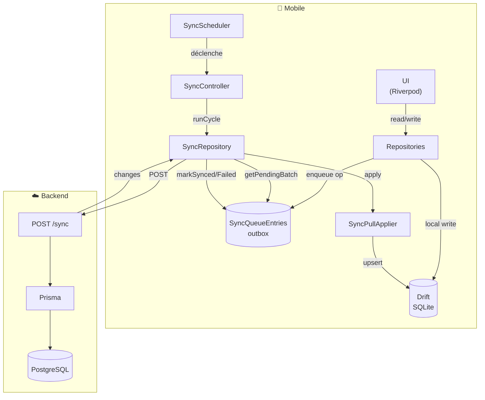
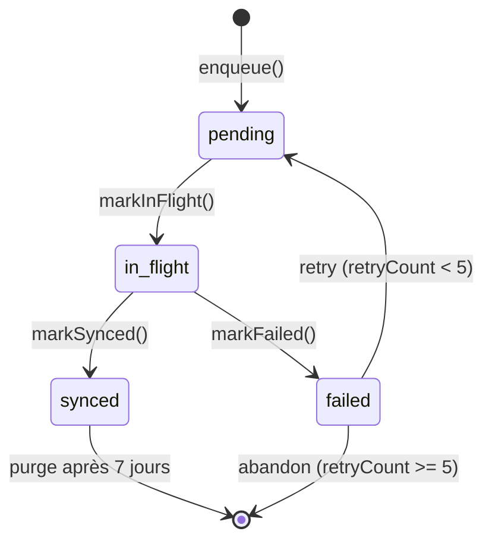
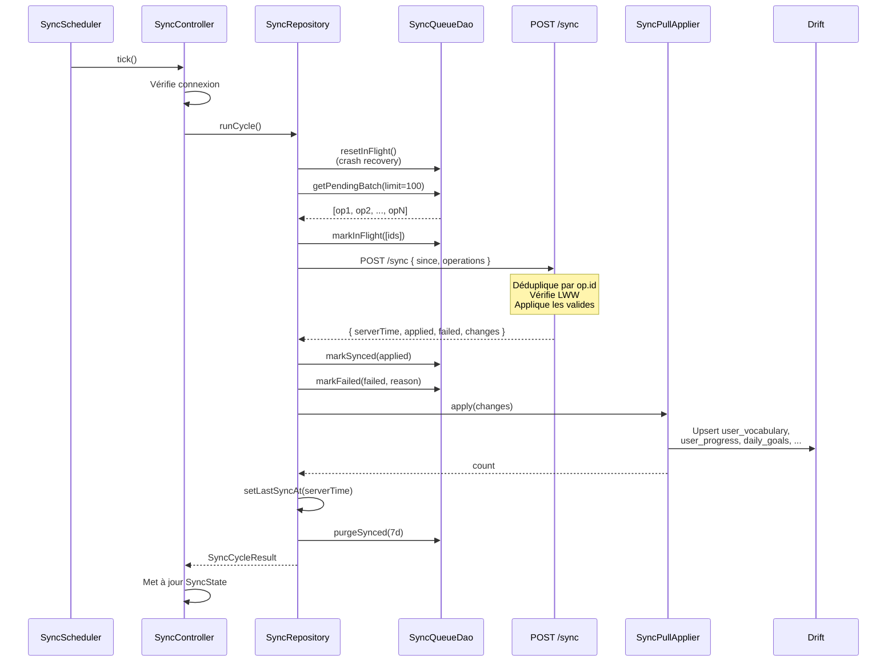

# 📡 Offline-First & Synchronisation — LangApp

> Guide complet du moteur offline-first et de la synchronisation client ↔ serveur.

---

## 📑 Table des matières

- [Principes](#-principes)
- [Architecture](#-architecture)
- [Outbox locale](#-outbox-locale)
- [Cycle de synchronisation](#-cycle-de-synchronisation)
- [Push (client → serveur)](#-push-client--serveur)
- [Pull (serveur → client)](#-pull-serveur--client)
- [Résolution de conflits](#-résolution-de-conflits)
- [Idempotence](#-idempotence)
- [Retry & gestion d'erreurs](#-retry--gestion-derreurs)
- [Déclencheurs](#-déclencheurs)
- [État UI](#-état-ui)
- [Cas limites](#-cas-limites)
- [Tests](#-tests)

---

## 🎯 Principes

LangApp est **offline-first** :

1. **Toute écriture est immédiatement locale** (Drift) → l'UI réagit instantanément.
2. **Chaque écriture est enregistrée** dans une **outbox locale** (`SyncQueueEntries`).
3. **Un moteur de sync** en arrière-plan pousse les opérations quand le réseau est disponible.
4. **Le pull** récupère les changements serveur et met à jour la base locale.
5. **L'app fonctionne intégralement hors ligne** : lecture, écriture, review, exercices, complétion de leçon.

**Utilisateur connecté requis** : la sync nécessite un `userId` local (après login). Sans session, les opérations restent en pending jusqu'au login.

---

## 🏛️ Architecture



---

## 📦 Outbox locale

Table `SyncQueueEntries` (Drift) :

| Colonne | Type | Description |
|---|---|---|
| `id` | TEXT (UUID) | **Clé d'idempotence** (généré client) |
| `entity` | TEXT | `user_vocabulary`, `user_progress`, `daily_goals`, `user_languages` |
| `entityId` | TEXT (UUID) | Clé naturelle |
| `op` | TEXT | `UPSERT` \| `DELETE` |
| `payloadJson` | TEXT | JSON du payload |
| `status` | TEXT | `pending` \| `in_flight` \| `synced` \| `failed` |
| `retryCount` | INT | Nombre de tentatives |
| `errorMessage` | TEXT | Message d'erreur (si `failed`) |
| `clientTimestamp` | DATETIME | Timestamp client (pour LWW) |
| `createdAt` | DATETIME | |
| `updatedAt` | DATETIME | |

**Cycle de vie d'une opération** :



### Enqueue (idempotent par entité)

```dart
Future<void> enqueue({
  required String id,
  required String entity,
  required String entityId,
  required String op,
  Map<String, dynamic>? payload,
  DateTime? clientTimestamp,
}) async {
  // Supprime toute opération pending existante pour la même entité
  await (delete(syncQueueEntries)
        ..where((t) =>
            t.entity.equals(entity) &
            t.entityId.equals(entityId) &
            t.status.equals('pending')))
      .go();

  // Insère la nouvelle opération
  await into(syncQueueEntries).insert(
    SyncQueueEntriesCompanion.insert(
      id: id,
      entity: entity,
      entityId: entityId,
      op: op,
      payloadJson: Value(payload == null ? null : jsonEncode(payload)),
      clientTimestamp: clientTimestamp ?? DateTime.now(),
    ),
  );
}
```

**Effet** : si l'utilisateur modifie 10 fois un mot avant la sync, seule la **dernière modification** est poussée.

---

## 🔄 Cycle de synchronisation



### Étapes détaillées

**1. Vérifications préalables**
- Utilisateur connecté (`userId` local) ?
- Réseau disponible (`connectivity_plus`) ?

**2. Crash recovery**
- Toutes les opérations en `in_flight` (crash précédent) repassent en `pending`.

**3. Lecture batch**
- Récupère jusqu'à 100 opérations `pending` ou `failed` (avec `retryCount < 5`).
- Tri par `createdAt ASC` (ordre chronologique).

**4. Marquage `in_flight`**
- Empêche une seconde sync concurrente de les reprendre.

**5. POST /sync**
- Envoie `since` (dernier `serverTime` connu) + opérations.
- Timeout : 30s.

**6. Application des statuts**
- `applied[]` → `markSynced`
- `failed[]` → `markFailed`

**7. Application des changements**
- `SyncPullApplier.apply(changes)` → upsert dans Drift.
- Aucune ré-enqueue (ce sont des données serveur autoritaires).

**8. Curseur**
- `lastSyncAt = serverTime` (dans `SharedPreferences`).

**9. Purge**
- `purgeSynced(olderThan: 7d)`.

---

## 📤 Push (client → serveur)

### Format

```json
{
  "since": "2025-01-15T09:00:00.000Z",
  "operations": [
    {
      "id": "client-uuid-1",
      "entity": "user_vocabulary",
      "entityId": "vocabulary-uuid",
      "op": "UPSERT",
      "clientTimestamp": "2025-01-15T10:00:00.000Z",
      "payload": {
        "state": "LEARNING",
        "isFavorite": false,
        "repetitions": 0,
        "intervalDays": 0,
        "easeFactor": 2.5,
        "successRate": 0,
        "difficulty": 0,
        "nextReviewAt": "2025-01-15T10:00:00.000Z",
        "lastReviewedAt": null
      }
    }
  ]
}
```

### Entités syncables

| Entity | Payload | Remarques |
|---|---|---|
| `user_vocabulary` | state, isFavorite, repetitions, intervalDays, easeFactor, successRate, difficulty, nextReviewAt, lastReviewedAt | Soft delete supporté |
| `user_progress` | status, score, timeSpentSec, completedAt | `COMPLETED` prioritaire |
| `daily_goals` | type, target, isActive | |
| `user_languages` | levelId, isActive | |

### Entités server-authoritative (pull uniquement)

- `streaks`
- `user_badges`
- `daily_activity`

Ces entités sont calculées côté serveur et simplement rapatriées.

---

## 📥 Pull (serveur → client)

### Format de réponse

```json
{
  "serverTime": "2025-01-15T10:01:00.000Z",
  "changes": {
    "user_vocabulary": [ /* rows */ ],
    "user_progress": [],
    "daily_goals": [],
    "user_languages": [],
    "streaks": [ { "id": "...", "currentStreak": 3, ... } ],
    "user_badges": [],
    "daily_activity": []
  }
}
```

### Incrémental

Le serveur renvoie uniquement les lignes avec `updatedAt > since` (ou `earnedAt > since` pour les badges).

**Fenêtre initiale** : si `since` absent (première sync), le serveur renvoie les changements des **30 derniers jours**.

### Application (`SyncPullApplier`)

Pour chaque collection :
- Mappe les champs JSON → colonnes Drift
- **Upsert direct** (`insertOnConflictUpdate`)
- **Pas d'enqueue** (données serveur)

---

## ⚖️ Résolution de conflits

### Politique : Last-Write-Wins (LWW)

Comparaison : `serverUpdatedAt` vs `clientTimestamp`

```typescript
if (existing && serverWins(existing.updatedAt, clientTs)) {
  return { applied: false, reason: 'CONFLICT', message: 'Server version is newer' };
}
```

### Exceptions

**`user_progress.COMPLETED`** : si le client a terminé une leçon hors ligne, on **accepte** même si le serveur a une version plus récente `IN_PROGRESS`.

```typescript
const serverCompleted = existing.status === 'COMPLETED';
const clientCompleted = status === 'COMPLETED';
if (!(clientCompleted && !serverCompleted)) {
  return { applied: false, reason: 'CONFLICT', ... };
}
```

**Soft delete → UPSERT** : si l'entité est `deletedAt` côté serveur mais que le client fait un UPSERT avec `clientTimestamp > updatedAt`, l'entité est **ressuscitée** (`deletedAt: null`).

### Cas multi-device

**Scénario** :
1. Device A (offline) : marque un mot comme `MASTERED` à T1
2. Device B (online) : modifie le même mot à T2 > T1
3. Device A se reconnecte : sa modification est rejetée (CONFLICT)

**Résultat** : la version de Device B (plus récente) est conservée. L'utilisateur reçoit une notification `sync: 1 opération rejetée`.

---

## 🔁 Idempotence

Chaque opération a un **UUID client**. Le serveur enregistre chaque opération traitée dans `sync_operations`.

**Sur rejeu** :
- Le serveur détecte l'`id` déjà présent
- Ignore l'opération (ni `applied` ni `failed`)

**Bénéfice** : si le client perd la réponse (crash, timeout), il peut renvoyer sans risque de double application.

---

## 🔄 Retry & gestion d'erreurs

### Retry exponentiel (côté client)

| Tentative | Délai |
|---|---|
| 1 | 1s |
| 2 | 2s |
| 3 | 4s |
| 4 | 8s |
| 5 | 16s |
| 6+ | Abandon (retryCount max = 5) |

**Déclenchement** : uniquement sur erreurs non-réseau (5xx, timeout serveur). Les erreurs réseau déclenchent une nouvelle tentative au prochain retour online.

### Types d'erreurs

| Erreur | Comportement |
|---|---|
| `NetworkFailure` | Statut `offline`, retry au prochain trigger |
| `UnauthorizedFailure` (401) | Statut `error`, déclenche `onSessionExpired` |
| `ServerFailure` (5xx) | Statut `error`, retry exponentiel |
| `ValidationFailure` (422) | Chaque op concernée → `failed` (pas de retry) |
| `CONFLICT` (par op) | Op marquée `failed`, pas de retry |

### Opérations abandonnées

Après 5 tentatives (`retryCount >= 5`), l'opération reste en `failed` indéfiniment. Elle n'est plus incluse dans `getPendingBatch`.

**Résolution** : l'utilisateur peut les purger via Paramètres → "Réinitialiser la synchronisation".

---

## 🎯 Déclencheurs

Le **`SyncScheduler`** orchestre 5 déclencheurs :

```dart
class SyncScheduler with WidgetsBindingObserver {
  void start() {
    // 1. Démarrage de l'app
    Future.microtask(_onAppStart);

    // 2. Retour de connexion réseau
    _connectivitySub = _ref.listen(isConnectedProvider, (prev, next) {
      next.whenData((connected) {
        if (connected) _ref.read(syncControllerProvider.notifier).tick();
      });
    });

    // 3. Changement d'auth (login → sync, logout → reset)
    _authSub = _ref.listen(authControllerProvider, (prev, next) {
      if (prev?.isAuthenticated == true && !next.isAuthenticated) {
        _ref.read(syncControllerProvider.notifier).reset();
      } else if (prev?.isAuthenticated != true && next.isAuthenticated) {
        _ref.read(syncControllerProvider.notifier).tick();
      }
    });

    // 4. Timer périodique (5 min)
    _timer = Timer.periodic(const Duration(minutes: 5), (_) {
      if (_ref.read(authControllerProvider).isAuthenticated) {
        _ref.read(syncControllerProvider.notifier).tick();
      }
    });

    // 5. Retour foreground
    WidgetsBinding.instance.addObserver(this);
  }

  @override
  void didChangeAppLifecycleState(AppLifecycleState state) {
    if (state == AppLifecycleState.resumed) {
      _ref.read(syncControllerProvider.notifier).tick();
    }
  }
}
```

**`tick()`** (intelligent) :
```dart
Future<void> tick() async {
  if (_inFlight) return;
  await _refreshPendingCount();
  final shouldSync = state.pendingCount > 0 ||
      state.lastSyncAt == null ||
      DateTime.now().difference(state.lastSyncAt!) > const Duration(minutes: 15);
  if (shouldSync) {
    await sync(silent: true);
  }
}
```

---

## 🎨 État UI

### `SyncStatus` (enum)

| Valeur | Signification |
|---|---|
| `idle` | À jour, rien en attente |
| `syncing` | Sync en cours |
| `error` | Erreur (5xx, validation) |
| `offline` | Hors ligne |
| `pending` | Opérations en attente (mais pas en cours) |

### `SyncState` (Notifier)

```dart
class SyncState {
  final SyncStatus status;
  final int pendingCount;
  final DateTime? lastSyncAt;
  final SyncCycleResult? lastResult;
  final String? errorMessage;
  final int consecutiveFailures;
}
```

### Composants UI

**`SyncStatusChip`** (AppBar) : icône colorée + tooltip + tap pour sync manuel.

**`SyncStatusBanner`** (inline, Home) : message informatif, tap pour sync.

---

## ⚠️ Cas limites

### Crash en pleine sync

**Situation** : l'app crash après `markInFlight` mais avant la réponse serveur.

**Solution** : au démarrage, `resetInFlight()` repasse toutes les opérations `in_flight` en `pending`.

### Perte de réponse après succès serveur

**Situation** : le serveur applique mais la réponse n'arrive pas.

**Solution** : au prochain cycle, le client renvoie les mêmes `op.id` → serveur détecte le doublon (via `sync_operations`) → ignore.

### Multi-device simultané

**Situation** : 2 devices modifient la même entité à la même seconde.

**Solution** : LWW sur `updatedAt` (milliseconde près). Le perdant reçoit un `CONFLICT`.

### Horloge désynchronisée

**Situation** : l'horloge du device est décalée de plusieurs heures.

**Solution** : le client utilise `DateTime.now()` mais le serveur se base sur son propre temps serveur. Un device en retard verra ses opérations rejetées (CONFLICT).

**Amélioration future** : synchroniser l'heure device ↔ serveur au démarrage.

### Migration de schéma

**Situation** : le schéma Drift évolue entre 2 versions de l'app.

**Solution** : `MigrationStrategy.onUpgrade` dans `AppDatabase`. Les anciennes opérations `pending` sont conservées tant que le schéma reste compatible.

### Changement de compte

**Situation** : l'utilisateur se déconnecte puis se reconnecte avec un autre compte.

**Solution** : `logout()` appelle `syncRepository.reset()` → `SyncQueueDao.wipe()`. Évite de pousser les opérations de l'ancien compte.

---

## 🧪 Tests

### Backend (`backend/tests/integration/sync.test.ts`)

- ✅ UPSERT appliqué et retourné dans `changes`
- ✅ Idempotence sur rejeu d'`op.id`
- ✅ Détection de conflit LWW
- ✅ Validation de l'entité (422 sur type invalide)
- ✅ Pull depuis un curseur

### Mobile (`mobile/test/unit/sync_repository_test.dart` — à ajouter)

- ✅ `runCycle` marque les opérations synced
- ✅ `runCycle` marque les opérations failed
- ✅ `SyncPullApplier` met à jour Drift
- ✅ Retry exponentiel après erreur
- ✅ Reset sur logout

### Test manuel

```bash
# 1. Lancer le backend
cd backend && npm run dev

# 2. Lancer l'app mobile en mode avion

# 3. Effectuer 3 actions (learn a word, complete a lesson, change favorite)
# → Compteur pending = 3

# 4. Réactiver le réseau
# → Sync automatique en < 3s
# → Compteur pending = 0

# 5. Vérifier côté serveur
psql langapp -c "SELECT entity, entity_id, op, status FROM sync_operations ORDER BY created_at DESC LIMIT 10;"
```

---

## 🔗 Voir aussi

- [Architecture](./architecture.md)
- [API Reference — /sync](./api.md#-synchronisation)
- [Database Schema — sync_operations](./database.md#sync_operations)
- [Backend sync module](../backend/src/modules/synchronization/)
- [Mobile sync feature](../mobile/lib/features/sync/)
